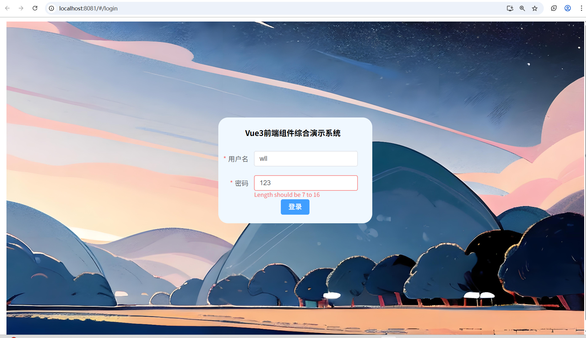
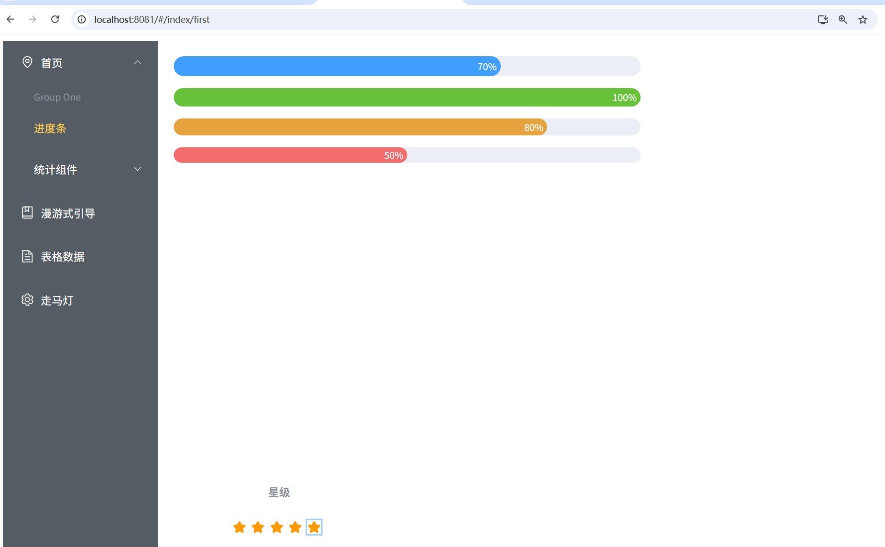
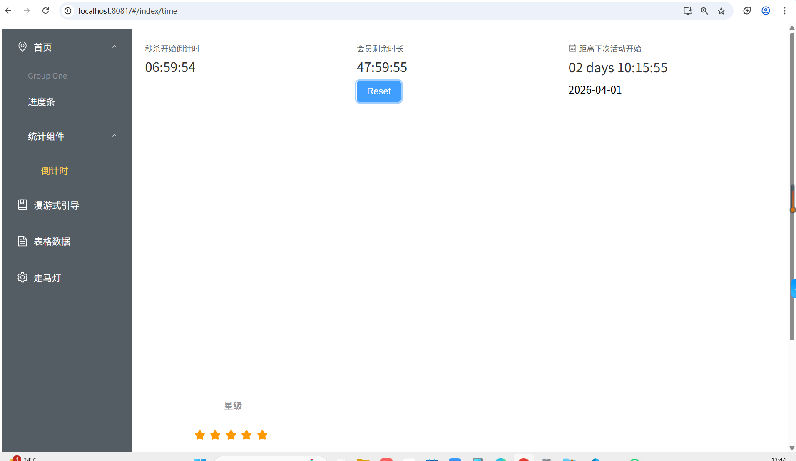
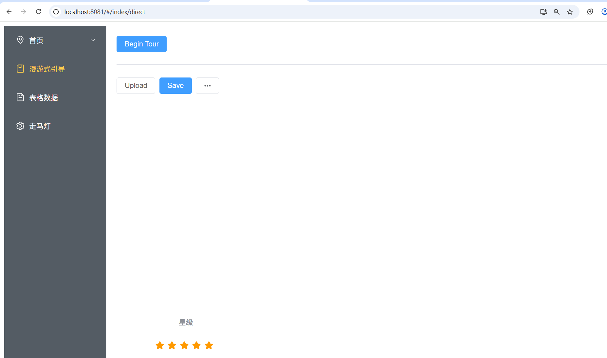
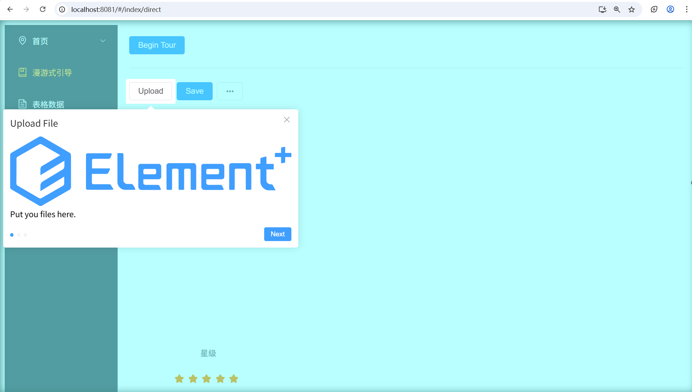
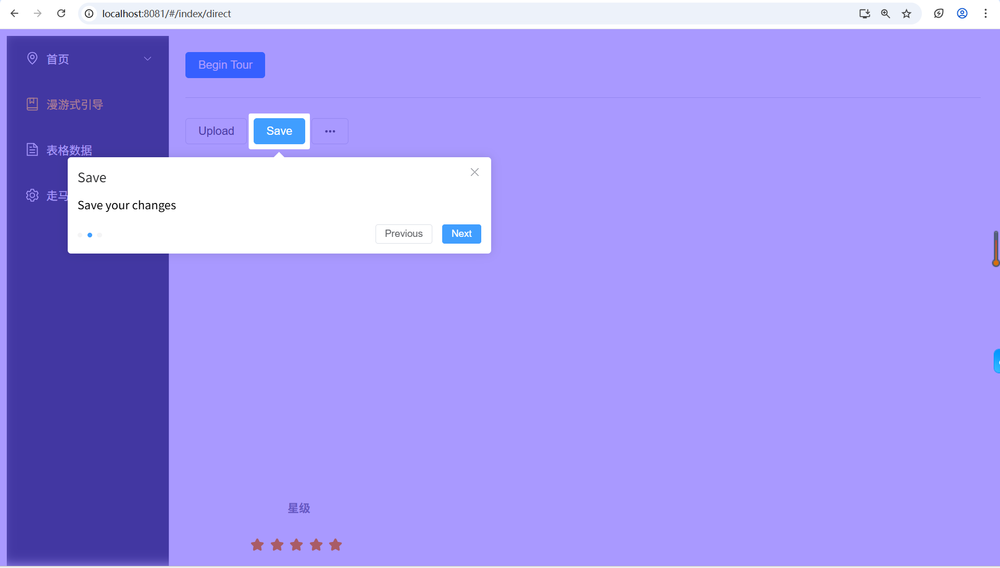
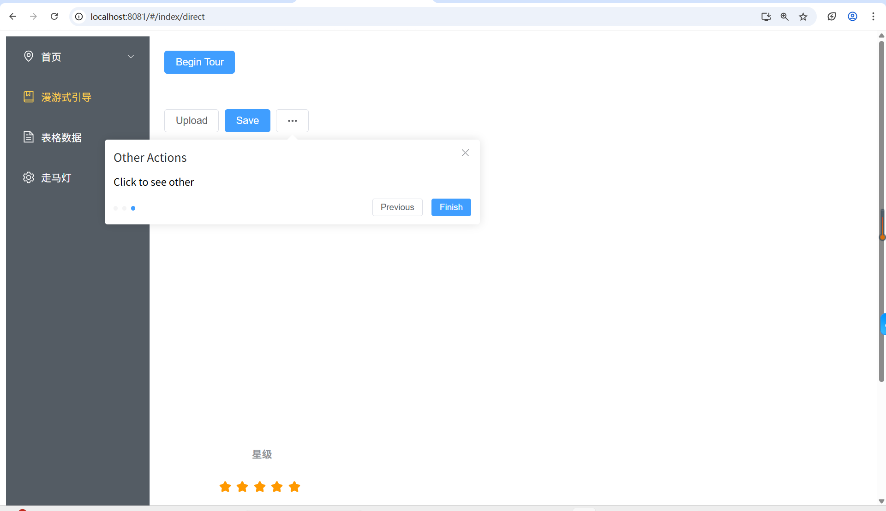
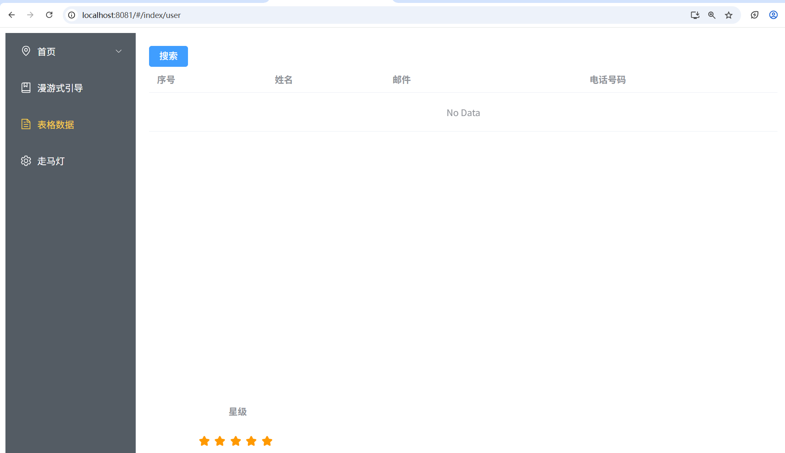
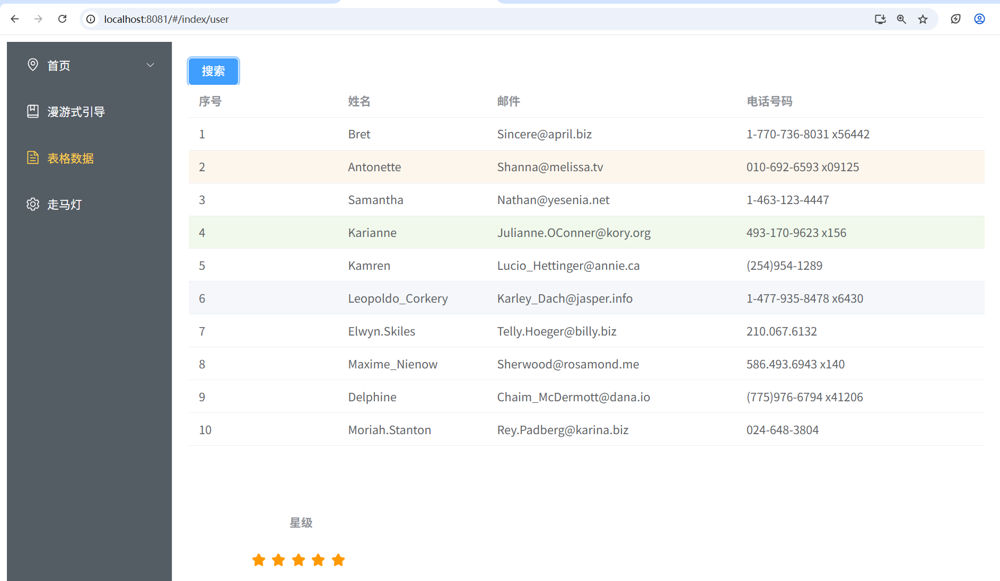

# Vue3 前端组件实践与演示项目

基于 Vue3 + Element Plus 开发的前端组件综合演示项目，包含登录页面、表格数据展示、倒计时、走马灯等功能，用于练习前端组件化开发与工程化能力。

## 技术栈
- Vue 3
- Element Plus
- Vue Router
- Axios

## 项目运行截图

## 项目说明
本项目为前端学习实践项目，涵盖常见 UI 组件使用、路由管理与数据交互，适合作为保研面试展示的个人技术练习作品。
